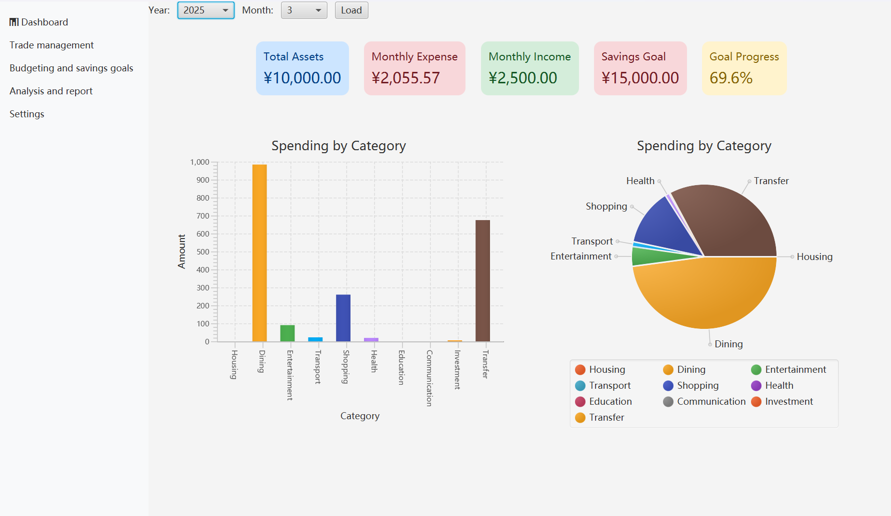
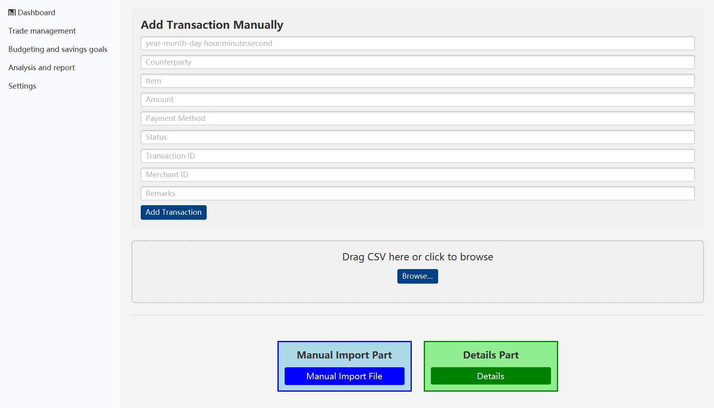
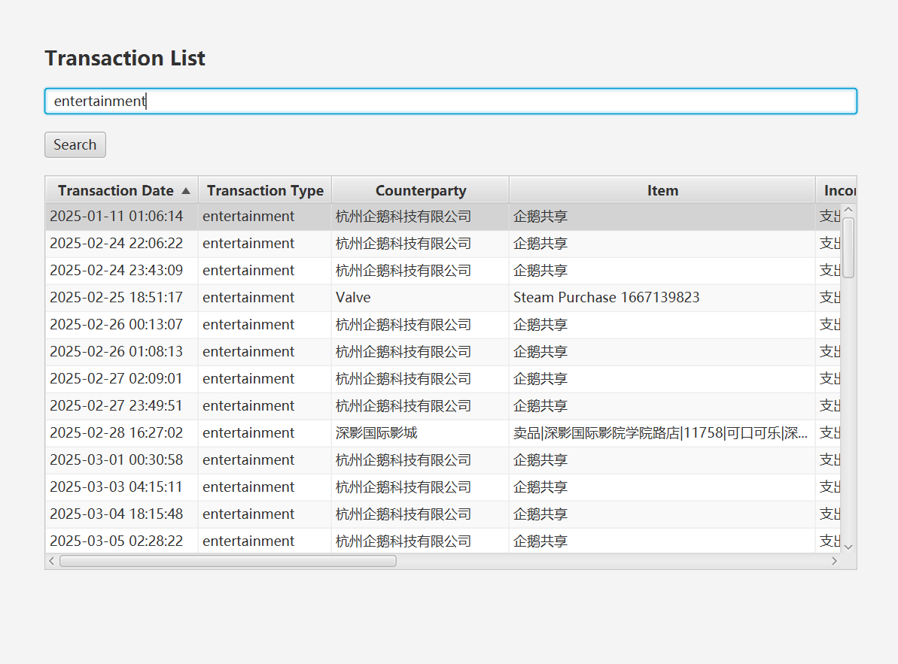
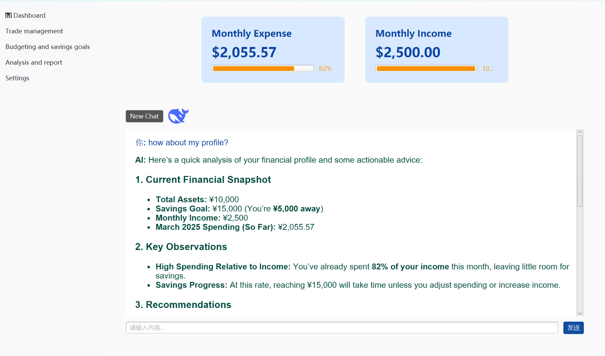
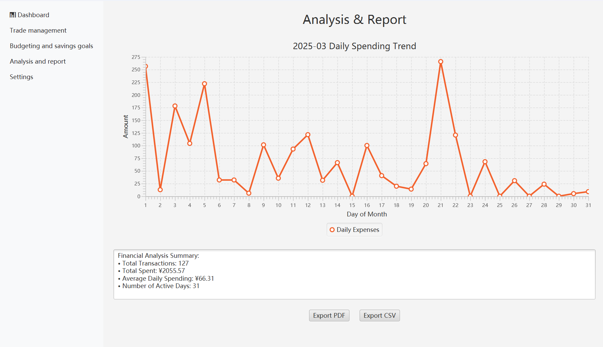
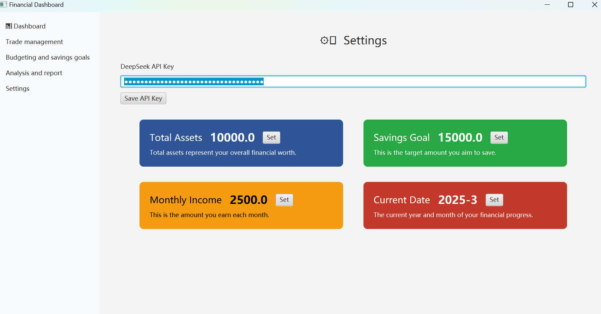
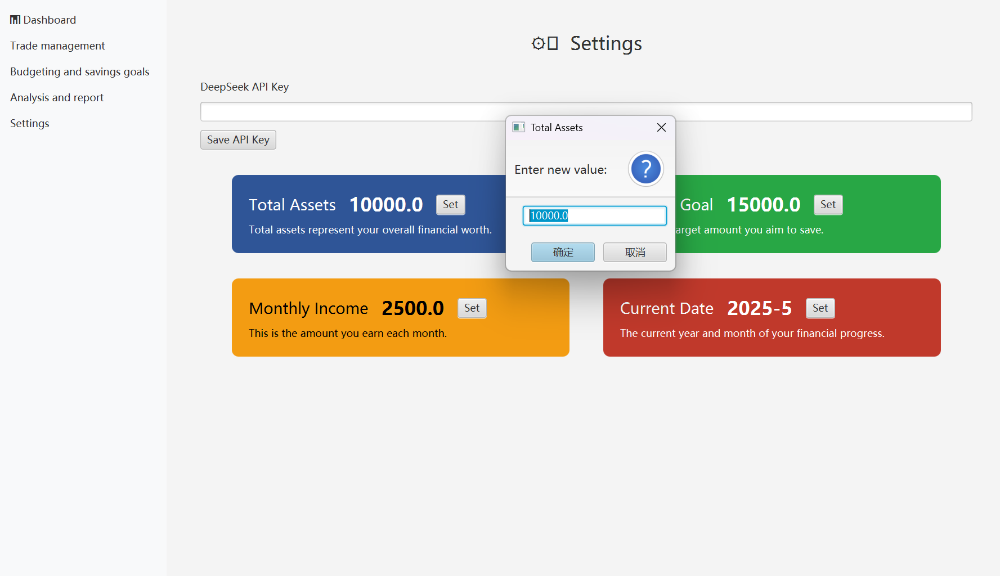

# 💰 Smart Budget Assistant

A personal finance dashboard that integrates visual analytics with AI-powered transaction classification. This project contains **two versions**:

- 🧪 Version 1: UI and backend are separate.
- ✅ Version 2: First integrated test with a unified entry point and partial service wiring.
- 🚀 **Version 3**: Full integration with intelligent reasoning, export, and user customization support.

---

## ⚙️ How to Set Up and Run the Project

### ✅ Prerequisites

Before running the project, please ensure the following environment is set up:

| Tool           | Version Suggestion | Required? | Notes |
|----------------|-------------------|-----------|-------|
| **Java JDK**   | 17 or 21           | ✅        | Make sure `java -version` is accessible in CMD |
| **Maven**      | 3.8+               | ✅        | Use `mvn -v` to verify |
| **JavaFX SDK** | 19+                | ✅        | Download from [https://openjfx.io](https://openjfx.io) and unzip |

---

### 📦 Setup Steps

1. **Clone or download the repository**  
   Place it somewhere without spaces in the path (e.g., `C:\Users\YourName\Desktop`).

2. **Configure JavaFX**  
   Set the `PATH_TO_FX` in your system environment variables if needed.

3. **Check `pom.xml`**  
   Ensure the following dependencies and plugin exist (already included):

   ```xml
   <plugin>
     <groupId>org.openjfx</groupId>
     <artifactId>javafx-maven-plugin</artifactId>
     <version>0.0.8</version>
     <configuration>
       <mainClass>com.example.App</mainClass>
     </configuration>
   </plugin>
   
---

### 📦 Run Instructions

#### 1. Run the App (with Maven)
Open a terminal (CMD or Git Bash), navigate to the project root directory, and run:
```bash
mvn clean javafx:run
```
Maven will download dependencies and launch the JavaFX Smart Budget Assistant UI.

#### 2. Run Unit Tests
```bash
mvn test
```
#### 3. Generate Javadoc
Run the following Maven command in the project root directory:
```bash
mvn javadoc:javadoc
```
This will generate the Javadoc HTML files in:
```
target/site/apidocs/index.html
```
Open index.html in your browser to view the documentation.、

---

## 📌 Version 1 – UI / Backend Separated

> *Standalone front-end UI with no real data connection.*  
> Backend tools like AI classification and analytics are implemented but **not yet connected**.

### 🚀 Features

- JavaFX UI: Dashboard, Trade, Transactions, Budget, Analysis
- Each page extends `Application` and runs independently
- Static charts and hardcoded data for visualization
- Backend utilities under `utils/` (not yet used in UI)
  - `JsonUtils`, `CalcExpense`, `DeepSeek`, `ConfigUtil`
- Two empty placeholders: `SearchBudget.java`, `UserInputHandler.java`

### 🏗 Directory Layout (v1)

```
src/
└── main/
    ├── java/
    │   ├── Ui/
    │   │   ├── DashBoardUi.java
    │   │   ├── BudgetUi.java
    │   │   ├── ClassifiedUi.java
    │   │   ├── TradeUi.java
    │   │   ├── TransactionUi.java
    │   │   ├── AnalysisUi.java
    │   │   └── NavigationSuper.java
    │   ├── utils/
    │   │   ├── CalcExpense.java
    │   │   ├── JsonUtils.java
    │   │   ├── DeepSeek.java
    │   │   ├── ConfigUtil.java
    │   │   ├── SearchBudget.java
    │   │   └── UserInputHandler.java
    │   ├── pojo/
    │   │   └── Transaction.java
    │   └── App.java
    └── resources/
        └── data/
            ├── csv/
            └── transactionData.json
```

### ▶️ Operation result (v1)


---

## ✅ Version 2 – First Integrated Version

> *UI + backend merged into one executable with real data and basic service calls.*

### ✨ What's New

- Single entry point: `App.java` (only one `launch()` call)
- UI receives real-time data from `utils/`
  - Expense stats from `CalcExpense`
  - Category predictions from `DeepSeek`
- CSV Import → JSON merge → Auto-classification from UI
- WIP: `SearchBudget` and `UserInputHandler` have basic logic

### 🏗 Directory Layout (v2)

```
src/
└── main/
    ├── java/
    │   ├── app/App.java
    │   ├── ui/...
    │   ├── utils/...
    │   ├── pojo/...
    │   └── service/...
    └── resources/
        ├── config.properties
        └── data/
            ├── csv/
            └── transactionData.json
```

### ▶️ Operation result (v2)


## ✅ Version 3 – Smart Budget Assistant with Full Integration and AI Reasoning

🎯 **UI + Backend fully integrated** with interactive dashboards, CSV support, real-time AI financial reasoning, and full user control over financial parameters.

---

### ✨ What's New in V3

- ✅ **Full AI reasoning integration**  
  Smart Budget Assistant now interprets user financial profiles and offers actionable insights.
- ✅ **Real-time chart updates**  
  Dashboard reflects selected month and year dynamically.
- ✅ **Dual-mode CSV import**  
  Manual entry and drag-and-drop file upload supported.
- ✅ **Search transactions**  
  Keyword-based filtering in the transaction list table.
- ✅ **Settings panel**  
  Modify income, total assets, savings goal, API key, and current date/month.
- ✅ **Financial summary + trend**  
  Daily line chart and summary statistics with export options.
- ✅ **Export support**  
  One-click export to PDF or CSV in report view.

---

### 🧠 AI Capability

> Powered by DeepSeek API (user-provided)

- 📊 Personalized summaries (assets, goal gap, income/spending comparison)
- ⚠️ Observations (e.g., “You spent 82% of your income”)
- ✅ Recommendations to improve budget balance
- 💬 Supports natural language input (e.g., “how about my profile?”)

---

### 🏗 Directory Layout (v3)

```
src/
├── main/
│ ├── java/
│ │ ├── App.java # Application entry point
│ │ ├── pojo/
│ │ │ └── Transaction.java # Data model for transactions
│ │ ├── Ui/
│ │ │ ├── AnalysisUi.java # Expense trend chart + summary
│ │ │ ├── BudgetUi.java # Monthly savings progress panel
│ │ │ ├── DashBoardUi.java # Main dashboard with pie/bar charts
│ │ │ ├── NavigationSuper.java # Base class for UI switching
│ │ │ ├── SettingsUi.java # User-editable financial parameters
│ │ │ ├── TradeListUi.java # Transaction table view with search
│ │ │ ├── TradeUi.java # CSV/manual transaction input
│ │ │ └── TransactionUi.java # Transaction info visualization
│ │ ├── utils/
│ │ │ ├── CalcExpense.java # Budget and stats calculator
│ │ │ ├── DateContext.java # Stores selected year/month
│ │ │ ├── DeepSeek.java # AI model caller (e.g., DeepSeek)
│ │ │ ├── FinanceContext.java # Central financial state object
│ │ │ ├── JsonUtils.java # JSON / CSV import/export logic
│ │ │ ├── ProgressCallback.java # Visual feedback interface for loading
│ │ │ ├── ReportUtils.java # Export PDF/CSV report utilities
│ │ │ ├── StringUtil.java # Text formatting helper
│ │ │ └── UserInputHandler.java # Handles user input in AI chat
│
│ └── resources/
│ ├── data/
│ │ ├── csv/
│ │ │ └── 微信支付账单(20250225-20250324).csv # Sample imported file
│ │ └── transactionData.json # Transaction data file
│ └── ms*.ttc # Fonts used in JavaFX charts

```

### ▶️ Operation result (v3)















### 
<h2 style="font-family: Arial, sans-serif;">Team Member Responsibilities</h2>

<table border="1" cellspacing="0" cellpadding="8" style="width: 100%; border-collapse: collapse; font-family: Arial, sans-serif;">
  <thead>
    <tr style="background-color: #f2f2f2;">
      <th>Name</th>
      <th>BUPT ID</th>
      <th>QM ID</th>
      <th>Work</th>
    </tr>
  </thead>
  <tbody>
    <tr>
      <td>Linchuan Lu</td>
      <td>2022213680</td>
      <td>221170489</td>
      <td>I reconstructed and merged almost all the functions and made it a runnable software in the end. I designed and implemented the full data-analysis pipeline that powers our personal-finance dashboard. My work covered (1) parsing raw WeChat / Alipay CSVs, normalising fields and merging them into transactionData.json; (2) integrating DeepSeek’s API for automatic transaction categorisation, with multi-threaded calls, progress callbacks and fault-tolerant I/O, constructing and delivering user profile to the DeepSeek’s API; (3) building the unified FinanceContext / DateContext layers so that assets, goals and selected month propagate instantly to every UI; and (4) export utilities that turn Markdown advice into styled PDF reports with charts. These components now let users drag-drop a CSV and, within seconds, view updated bar-/pie-charts, AI suggestions and a downloadable report—all without manual data cleaning.</td>
    </tr>
    <tr>
      <td>Yeming Ma</td>
      <td>2022213673</td>
      <td>221170490</td>
      <td>As the frontend and data flow lead, I focused on implementing the interactive daily spending trend visualization in the AnalysisUI class, integrating dynamic line charts using JavaFX libraries to display daily expenses and transaction amounts. I designed the PDF/CSV export module by leveraging JsonUtils for data serialization and ReportUtils for formatting, ensuring seamless compatibility with financial summaries (e.g., total spent: ¥2055.57). Additionally, I unified the page navigation logic by extending the NavigationSuper class, enabling consistent transitions between screens like DashboardUI, TradeListUI, and SettingsUI. My work included rigorous testing of cross-page data persistence and resolving edge cases in date range filtering for the March 2025 dataset.</td>
    </tr>
    <tr>
      <td>Kai Huang</td>
      <td>2022213674</td>
      <td>221170652</td>
      <td>As the UI developer for the main interface and spending categorization interface, I ensured the visual design aligned precisely with the prototypes during the initial development phase. I implemented seamless page navigation logic and established well-defined functional interfaces to facilitate smooth collaboration with other developers for efficient project integration.In later stages, I focused on refining and enhancing the UI based on evolving requirements, optimizing both aesthetics and usability. Additionally, I contributed to revising the first version of the README documentation and assisted in its translation to ensure clarity and professionalism.I also wrote detailed Javadoc comments for key UI classes to improve maintainability and support future development, and generated the corresponding HTML documentation using the Maven Javadoc plugin.</td>
    </tr>
    <tr>
      <td>Yichen Song</td>
      <td>2022213669</td>
      <td>221170515</td>
      <td>I contributed to several core aspects of the project. My work included implementing a little portion of the frontend UI logic in JavaFX, especially during the early stages. I was also responsible for writing nearly the entire project’s README to clearly document our development iterations and usage instructions. In the later stages, I played a key role in bug fixing. Additionally, I wrote several unit and UI test classes using JUnit and TestFX, contributing to our testing framework. Finally, I took primary responsibility for drafting and polishing most of the project report.</td>
    </tr>
    <tr>
      <td>Guangming Guo</td>
      <td>2022213681</td>
      <td>221170478</td>
      <td>I am responsible for building the UI part and implementing the corresponding functions. In the early stages of the project, I completed the construction of interfaces related to transactions and implemented the corresponding interfaces using JavaFX. In the middle of the project, I was responsible for the jump logic of each interface and built a homepage to implement page jumps. In the later stages of the project, I implemented the corresponding functions related to transactions and realized the prototype of the final version of the page.</td>
    </tr>
    <tr>
      <td>Ziming Rong</td>
      <td>2022213675</td>
      <td>221170607</td>
      <td>Mainly about backend development. Helped with json files and csv files operations. Helped with adding new data into the json file by inputting data manually or using a csv file. Called DeepSeek api, implement the function of automatically classify users’ bills into several categories. Also, using thread pool to enhance the speed of batch classifying. Implement the method of giving advice to users’ budget. Add some unit test of some frequently used methods. Help other members solve conflicts when merging.</td>
    </tr>
  </tbody>
</table>


