# 💰 Smart Budget Assistant

A personal finance dashboard that integrates visual analytics with AI-powered transaction classification. This project contains **two versions**:

- 🧪 Version 1: UI and backend are separate.
- ✅ Version 2: First integrated test with a unified entry point and partial service wiring.

---

## 📌 Version 1 – UI / Backend Separated

> *Standalone front-end UI with no real data connection.*  
> Backend tools like AI classification and analytics are implemented but **not yet connected**.

### 🚀 Features

- JavaFX UI: Dashboard, Trade, Transactions, Budget, Analysis
- Each page extends `Application` and runs independently
- Static charts and hardcoded data for visualization
- Backend utilities under `utils/` (not yet used in UI)
    - `JsonUtils`, `CalcExpense`, `DeepSeek`, `ConfigUtil`
- Two empty placeholders: `SearchBudget.java`, `UserInputHandler.java`

### 🏗 Directory Layout (v1)

```
src/
└── main/
    ├── java/
    │   ├── Ui/
    │   │   ├── DashBoardUi.java
    │   │   ├── BudgetUi.java
    │   │   ├── ClassifiedUi.java
    │   │   ├── TradeUi.java
    │   │   ├── TransactionUi.java
    │   │   ├── AnalysisUi.java
    │   │   └── NavigationSuper.java
    │   ├── utils/
    │   │   ├── CalcExpense.java
    │   │   ├── JsonUtils.java
    │   │   ├── DeepSeek.java
    │   │   ├── ConfigUtil.java
    │   │   ├── SearchBudget.java
    │   │   └── UserInputHandler.java
    │   ├── pojo/
    │   │   └── Transaction.java
    │   └── App.java
    └── resources/
        └── data/
            ├── csv/
            └── transactionData.json
```

### ▶️ Operation result (v1)

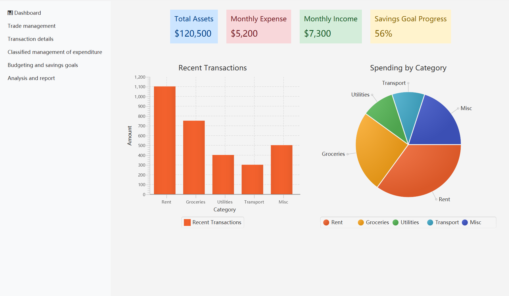

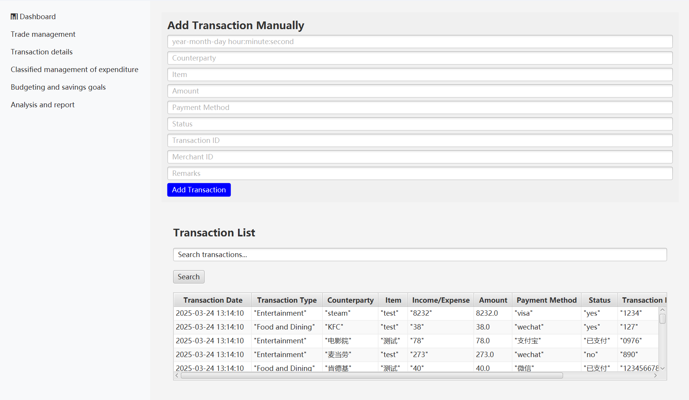

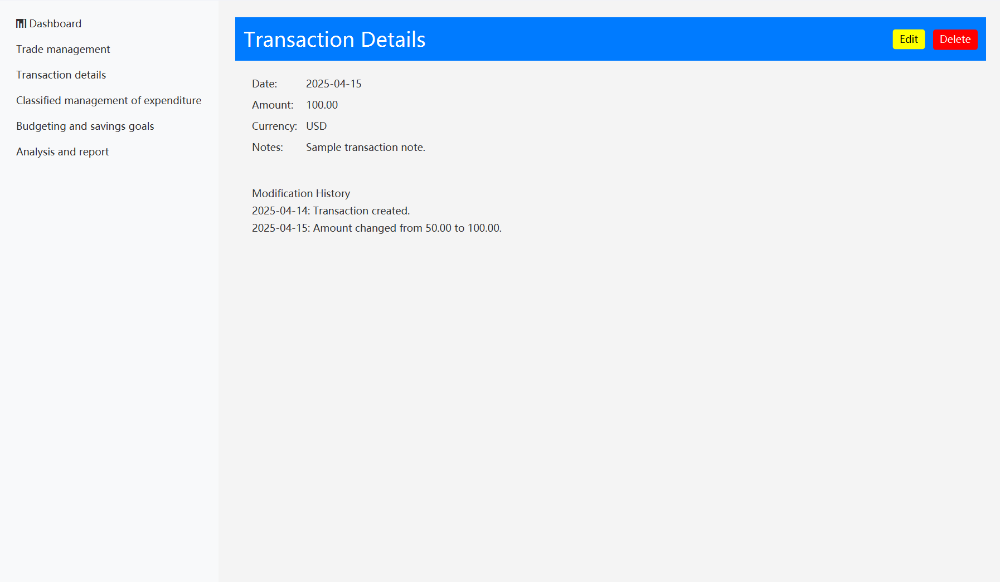

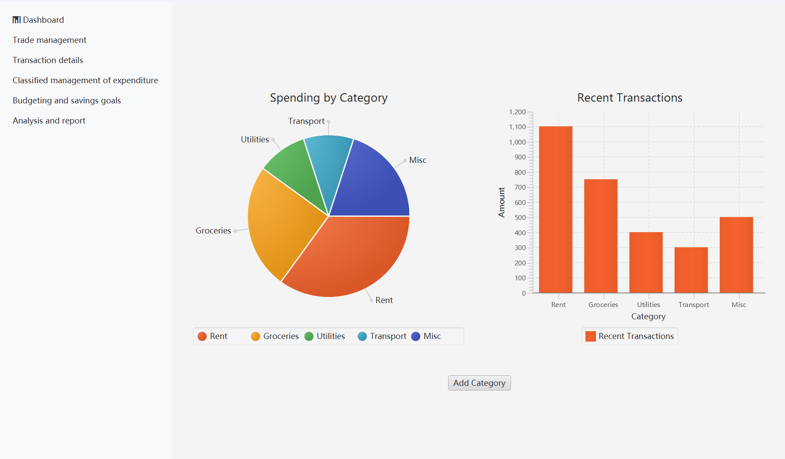

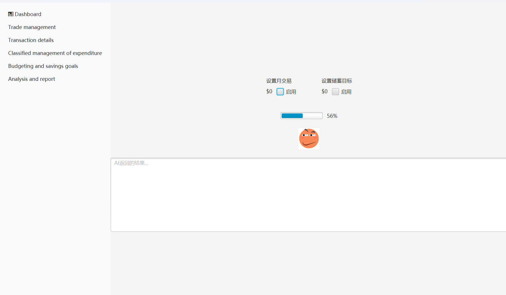

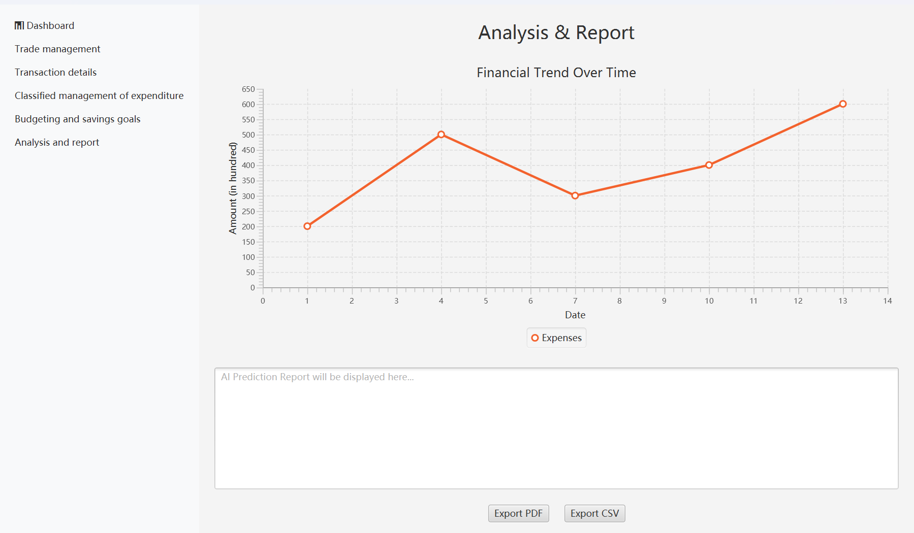

---

## ✅ Version 2 – First Integrated Version

> *UI + backend merged into one executable with real data and basic service calls.*

### ✨ What's New

- Single entry point: `App.java` (only one `launch()` call)
- UI receives real-time data from `utils/`
    - Expense stats from `CalcExpense`
    - Category predictions from `DeepSeek`
- CSV Import → JSON merge → Auto-classification from UI
- WIP: `SearchBudget` and `UserInputHandler` have basic logic

### 🏗 Directory Layout (v2)

```
src/
└── main/
    ├── java/
    │   ├── app/App.java
    │   ├── ui/...
    │   ├── utils/...
    │   ├── pojo/...
    │   └── service/...
    └── resources/
        ├── config.properties
        └── data/
            ├── csv/
            └── transactionData.json
```

### ▶️ Operation result (v2)

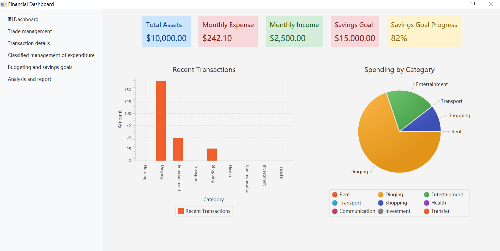

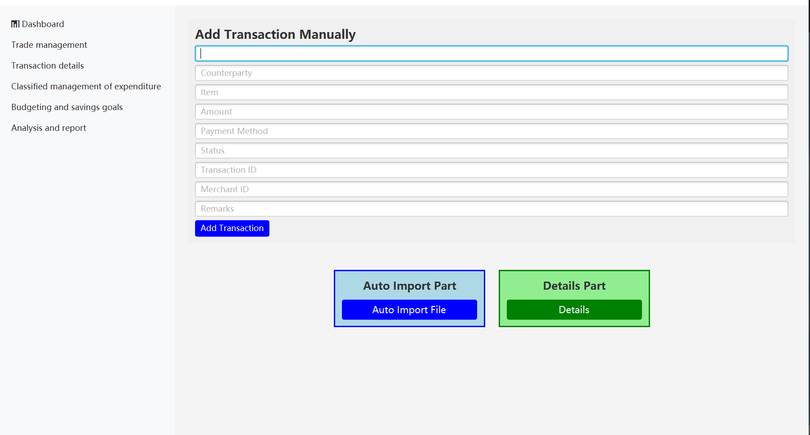

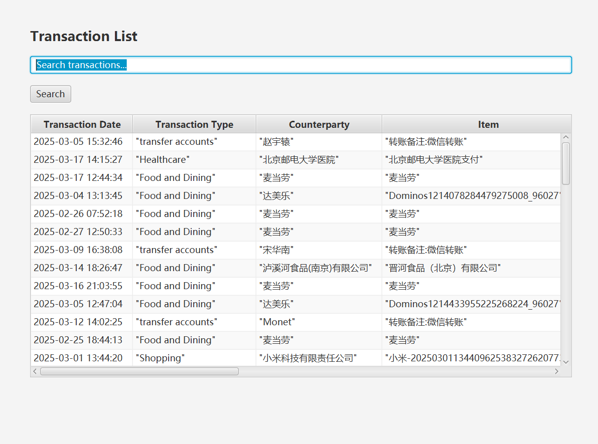

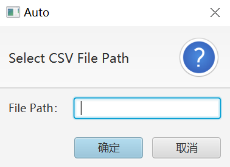

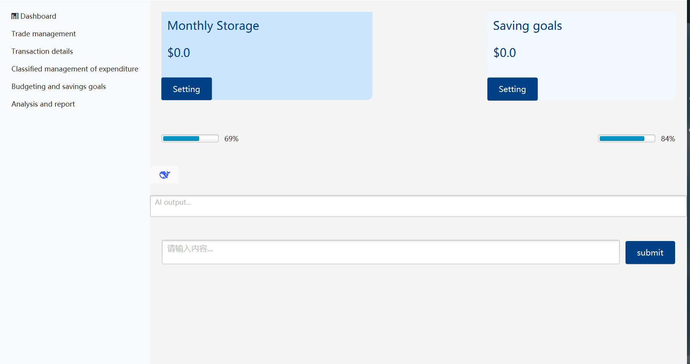

### 
<h2 style="font-family: Arial, sans-serif;">Team Member Responsibilities</h2>

<table border="1" cellspacing="0" cellpadding="8" style="width: 100%; border-collapse: collapse; font-family: Arial, sans-serif;">
  <thead>
    <tr style="background-color: #f2f2f2;">
      <th>Name</th>
      <th>Student ID</th>
      <th>QM ID</th>
      <th>Work</th>
    </tr>
  </thead>
  <tbody>
    <tr>
      <td>Linchuan Lu</td>
      <td>2022213680</td>
      <td>221170489</td>
      <td>Deploy Deepseek api, implement csv-to-json format conversion, moddify AI conversation ui and api-setting ui.</td>
    </tr>
    <tr>
      <td>Yeming Ma</td>
      <td>20210002</td>
      <td>210000002</td>
      <td>Backend development, database design</td>
    </tr>
    <tr>
      <td>Kai Huang</td>
      <td>2022213674</td>
      <td>221170652</td>
      <td>Designed main UI and classifiedmanagement interface.</td>
    </tr>
    <tr>
      <td>Yichen Song</td>
      <td>2022213669</td>
      <td>221170515</td>
      <td>Designed Budgeting and Analysis interface and write the version introduction.</td>
    </tr>
    <tr>
      <td>Guangming Guo</td>
      <td>2022213681</td>
      <td>221170478</td>
      <td>Designed Trade and Transaction interface and integrate the pages.</td>
    </tr>
    <tr>
      <td>Ziming Rong</td>
      <td>2022213675</td>
      <td>221170607</td>
      <td>Backend development, data management.</td>
    </tr>
  </tbody>
</table>


